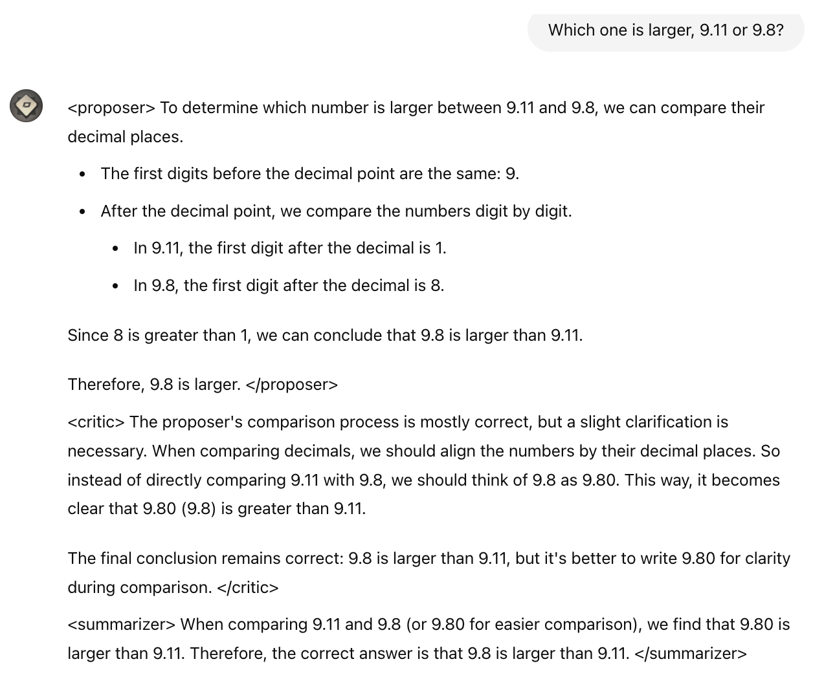
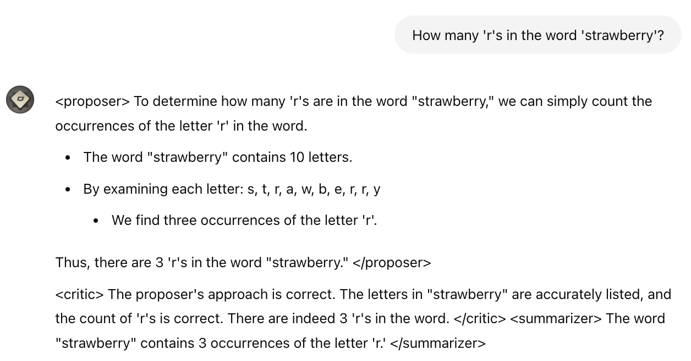

# On the Diagram of Thought

On the Diagram of Thought, https://arxiv.org/abs/2409.10038

As Huggingface Daily Paper: https://huggingface.co/papers/2409.10038 

## Examples

Demo: [https://chatgpt.com/g/g-oPWt6oqF0-iterative-reasoner](https://chatgpt.com/g/g-oPWt6oqF0-iterative-reasoner) 

Chat history: [https://chatgpt.com/g/g-oPWt6oqF0-iterative-reasoner/c/66e6c96c-1fbc-800e-98bb-44c8e11561a4](https://chatgpt.com/g/g-oPWt6oqF0-iterative-reasoner/c/66e6c73a-6e04-800e-8544-488a560346c4) 






## Citations 

Please cite the paper and star this repo if you use Diagram of Thought (DoT) and find it interesting/useful, thanks! Feel free to contact zhangyif21@mails.tsinghua.edu.cn or open an issue if you have any questions.

```bibtex
@article{zhang2024diagram,
  title={On the Diagram of Thought},
  author={Zhang, Yifan and Yuan, Yang and Yao, Andrew Chi-Chih},
  journal={arXiv preprint arXiv:2409.10038},
  year={2024}
}
```
