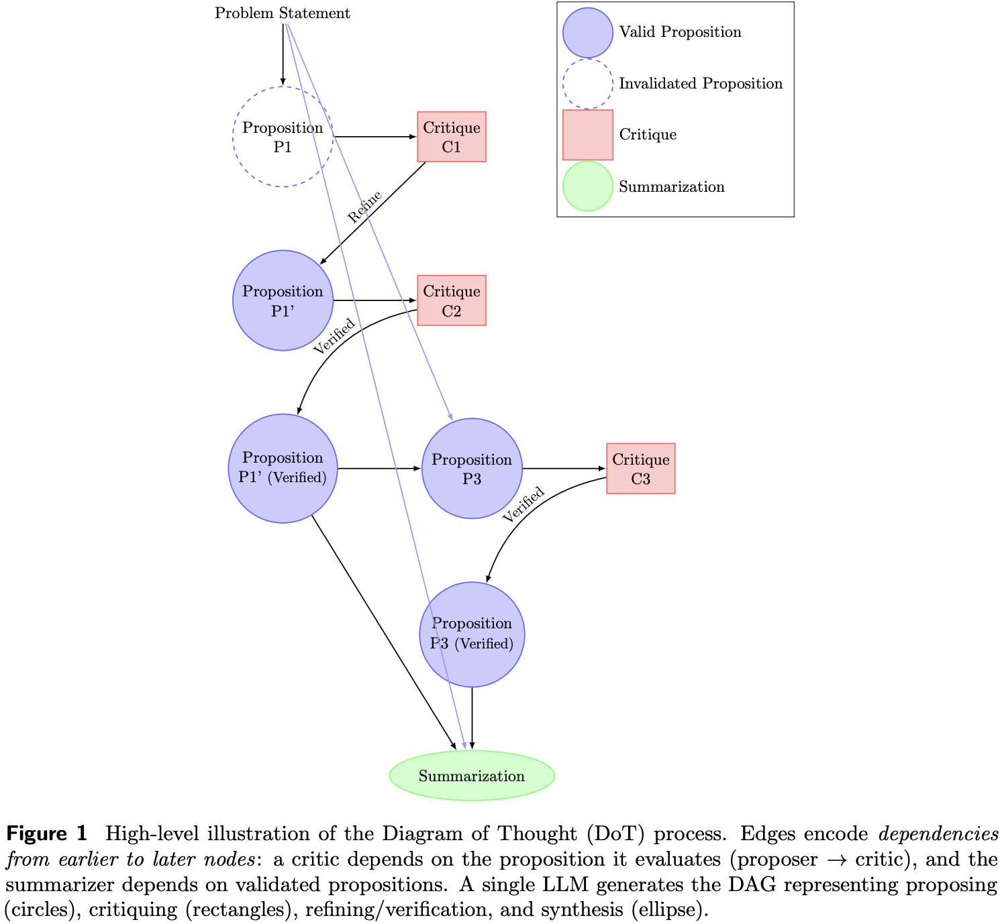
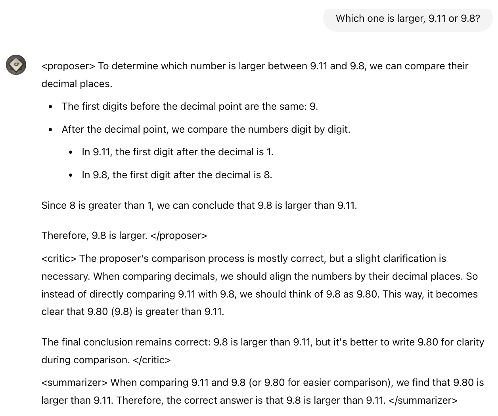
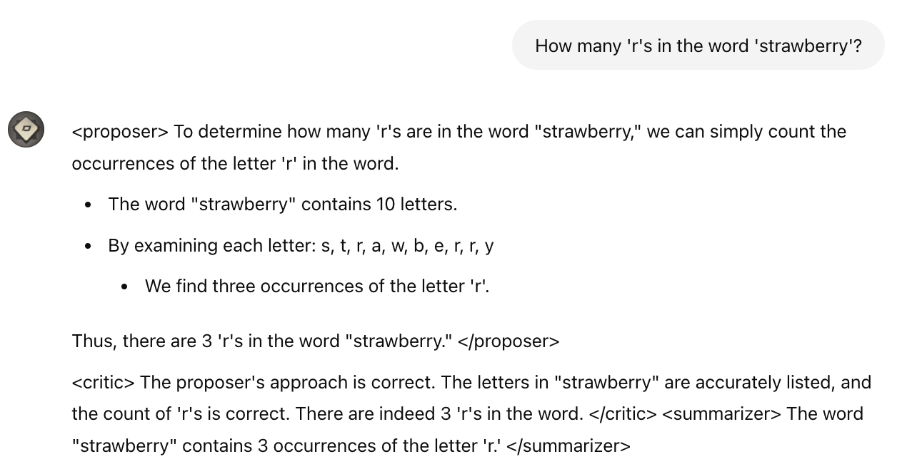

# Diagram of Thought (DoT)

[](https://arxiv.org/abs/2409.10038)
[](https://huggingface.co/papers/2409.10038)
[](https://github.com/diagram-of-thought/diagram-of-thought/stargazers)

**Paper:** [https://arxiv.org/abs/2409.10038](https://arxiv.org/abs/2409.10038)

## What is Diagram of Thought?

Large Language Models (LLMs) often struggle with complex reasoning that requires exploration, backtracking, and self-correction. While methods like Chain-of-Thought (CoT) improve linear reasoning, they cannot capture the non-sequential nature of sophisticated problem-solving.

**Diagram of Thought (DoT)** is a framework that enables a **single LLM** to construct and refine a mental map of its reasoning process. The model builds a Directed Acyclic Graph (DAG) where it can propose ideas, critique its own steps, and synthesize validated insights into a final conclusion. This entire process is self-contained and auditable, bridging the gap between fluent language and formal, verifiable reasoning.

<p align="center">

</p>

## Core Contributions

  * 🧠 **Controller-Light, Single-Model Reasoning:** DoT internalizes the *propose → critique → refine → summarize* loop within one autoregressive model using learned role tokens. This eliminates the need for complex external controllers, multi-agent orchestration, or explicit search algorithms required by other advanced reasoning methods.
  * ✅ **Auditable & Verifiable Traces:** A typed serialization protocol (`@node`, `@edge`, `@status`) ensures that the reasoning process is recorded as a well-structured DAG. This allows for deterministic extraction, post-hoc analysis, and verification of the model's reasoning path, crucial for safety and debugging.
  * 🏛️ **Formal Guarantees from Category Theory:** We ground DoT in a rigorous mathematical foundation using topos theory. This framework guarantees that the synthesis of validated information is principled, consistent, and robust. The final summary is formally a **colimit** in the information order, ensuring that the result is invariant to the order in which evidence was explored.
  * 🌿 **Strict Generalization of Linear Reasoning:** DoT's ability to manage parallel, incomparable lines of validated evidence makes it strictly more expressive than linear methods like Chain-of-Thought. Branching validated evidence cannot be faithfully embedded into a single inclusion chain, a limitation DoT overcomes by design.

## How DoT Compares to Other Methods

DoT integrates the structural advantages of graph-based reasoning with the efficiency of a self-contained, single-model system.

| Method                | Reasoning Structure        | Control Mechanism                                     | Key Innovation                                                              |
| --------------------- | -------------------------- | ----------------------------------------------------- | --------------------------------------------------------------------------- |
| Chain-of-Thought (CoT) | Linear Sequence            | Standard autoregressive decoding                      | Eliciting intermediate steps to improve reasoning.                           |
| Tree-of-Thought (ToT) | Tree                       | External controller with search algorithms (BFS, DFS) | Systematic exploration of diverse reasoning paths with backtracking.        |
| Graph-of-Thought (GoT)| Graph                      | External graph management system                      | Modeling arbitrary dependencies, including merging and cycles.              |
| **Diagram of Thought (DoT)** | **Directed Acyclic Graph (DAG)** | **Internalized via role tokens; controller-light validator** | **Single-model, self-correcting DAG construction with formal guarantees.** |

-----

## Quick Demo

  * **Interactive Sandbox (ChatGPT):** Try the DoT process yourself in this interactive GPT.

      * [https://chatgpt.com/g/g-oPWt6oqF0-iterative-reasoner](https://chatgpt.com/g/g-oPWt6oqF0-iterative-reasoner)

  * **Example Traces:** See how DoT handles numerical and logical reasoning tasks.

      * [Numerical Comparison Example](https://chatgpt.com/g/g-oPWt6oqF0-iterative-reasoner/c/66e6c96c-1fbc-800e-98bb-44c8e11561a4)
      * [Character Counting Example](https://chatgpt.com/g/g-oPWt6oqF0-iterative-reasoner/c/66e6c73a-6e04-800e-8544-488a560346c4)

<p align="center">
  
</p>
<p align="center">
  
</p>

-----

## Getting Started: A Minimal Prompt

You can guide any capable LLM to perform DoT reasoning with the following prompt structure. The model learns to alternate between roles to construct the reasoning graph. The **typed records** (`@node`, `@edge`, etc.) are optional for basic use but are essential for enabling the formal guarantees and auditable extraction.

```
You are a single model that performs Diagram-of-Thought (DoT) reasoning.
Your goal is to build a graph of reasoning steps to solve the problem.
You will use the following roles: <problem>, <proposer>, <critic>, and <summarizer>.

When possible, interleave typed records for auditability:
@node id=<n> role={problem|proposer|critic|summarizer}
@edge src=<i> dst=<n> kind={use|critique|refine}   (must have i < n)
@status target=<i> mark={validated|invalidated}

<problem>
<PASTE THE TASK HERE>
@node id=1 role=problem

<proposer>
Propose a concrete, atomic step towards the solution. Declare dependencies using @edge.
@node id=2 role=proposer
@edge src=1 dst=2 kind=use

<critic>
Evaluate the last proposition from the <proposer>. If it is correct and sound, mark it as 'validated'. If it is flawed, explain the flaw and mark it as 'invalidated'.
@node id=3 role=critic
@edge src=2 dst=3 kind=critique
@status target=2 mark=validated

<proposer>
Propose the next step. If a previous step was invalidated, refine it or propose an alternative branch.
@node id=4 role=proposer
@edge src=2 dst=4 kind=refine

<summarizer>
Once enough evidence is gathered, construct the final answer. Synthesize information ONLY from VALIDATED propositions and cite the IDs you used in your reasoning.
@node id=5 role=summarizer
@edge src=2 dst=5 kind=use
```

**Tips for Effective Use:**

  * **Be Strict:** For mathematics, logic, or code-related tasks, instruct the `<critic>` to be rigorous and always emit a `@status` record.
  * **Be Flexible:** For open-ended or creative tasks, allow for softer critiques, but still encourage the model to make an explicit validation decision.

-----

## How It Works: The DoT Process

DoT can be understood from three perspectives:

1.  **Operational View:** The model generates a single stream of text containing interleaved role tokens.

      * **`<proposer>`:** Emits a candidate proposition or reasoning step.
      * **`<critic>`:** Evaluates a prior step, marking it as `validated` or `invalidated`. This step can trigger refinements or branching.
      * **`<summarizer>`:** Aggregates information *only* from `validated` nodes to produce the final answer.

2.  **Structural View (Typed Protocol):** The `@` records provide a formal backbone for the reasoning.

    ```
    @node id=3 role=critic
    @edge src=2 dst=3 kind=critique
    @status target=2 mark=validated
    ```

    This protocol guarantees the graph is acyclic (since `@edge` sources must have smaller IDs than destinations) and enables deterministic extraction of the reasoning structure for analysis. An online validator can enforce these rules during generation.

3.  **Semantic View:** The formalism provides a powerful interpretation of the process.

      * Validated propositions are interpreted as subobjects in a mathematical space (a slice topos).
      * The final summary corresponds to a **colimit**—a universal construction that optimally "glues together" all validated pieces of evidence.
      * This guarantees that the synthesis is principled, robust, and invariant to isomorphic rearrangements of the reasoning graph.

## Who Should Use DoT?

  * **AI Researchers** studying structured reasoning, self-correction, or verifiability in LLMs who need **auditable traces** and a clean theoretical model.
  * **Practitioners** building applications in domains requiring high reliability and interpretability (e.g., finance, medicine, scientific discovery, data validation) without deploying a heavy external control system.
  * **Developers of AI Safety & Evaluation Tools** who need deterministic extraction of reasoning paths for unit testing, formal verification, and post-hoc analysis.

-----

## ⭐ Cite and Support

If the concepts, prompts, or formalisms from Diagram of Thought contribute to your work, please cite our paper and star this repository to help others discover it.

```bibtex
@article{zhang2024diagram,
  title        = {On the Diagram of Thought},
  author       = {Zhang, Yifan and Yao, Andrew Chi-Chih},
  journal      = {arXiv preprint arXiv:2409.10038},
  year         = {2024}
}
```
